# Publisering 
Hvordan gjøre innhold tilgjengelig på ditt hjemmeområde på internett?

* [Windows](#windows)
* [Mac](#mac)
* [Linux](#linux)
* [Terminal](#terminal)
* [Bidra](#bidra)

**NB:** For å koble på hjemmeområdet utenfor skolens nettverk (typisk hjemmefra), må du opprette en VPN-forbindelse og koble deg på denne. Instruksjoner finnes for [Mac](http://www.hioa.no/BIT/Nettverk/Veiledninger/VPN-tilkobling-for-Mac-OS-X-10.5-til-10.7), [Linux](http://www.hioa.no/BIT/Nettverk/Veiledninger/VPN-tilkobling-for-Linux-Ubuntu) og [Windows](http://www.hioa.no/BIT/Nettverk/Veiledninger/Tilgang-til-hjemmeomraade-for-Windows#manuell).

## Windows
1. Under "Computer" trykk "Map Network drive"
>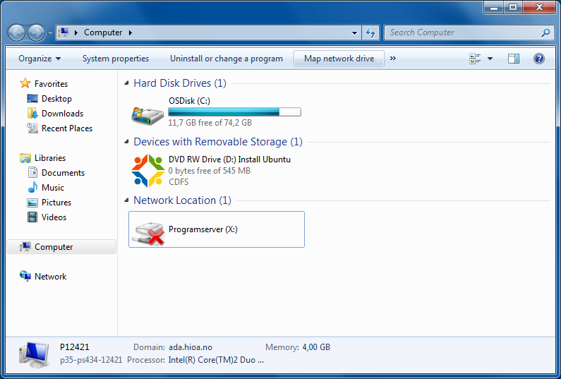

2. Skriv inn server-adresse som bå bildet, men med ditt studentnummer. Huk av for "Connect using different credentials"
>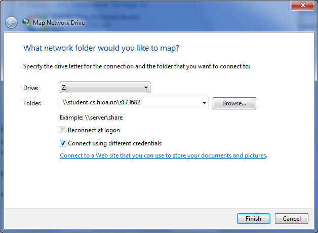

3. Skriv inn "ADA\sxxxxxx" der xxxxxx er ditt studentnummer, og passord. Vurder selv om du ønsker at passordet skal huskes - gjør dette kun dersom du har et sikkert passord på din PC, som automatisk kommer på.
>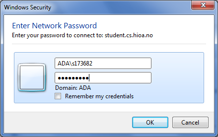

4. Du får nå opp en mappe med ditt hjemmeområde. Alt som legges inne i www-mappen havner på nett.
>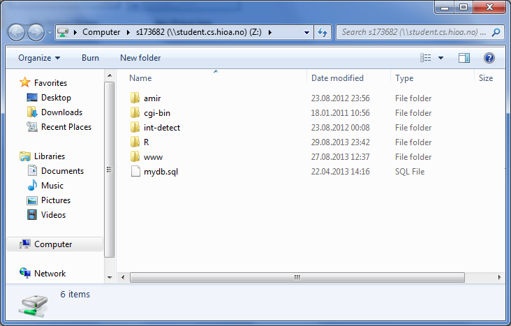

5. HTML-filer kan legges direkte i denne mappen, eller du kan legge det i undermapper
>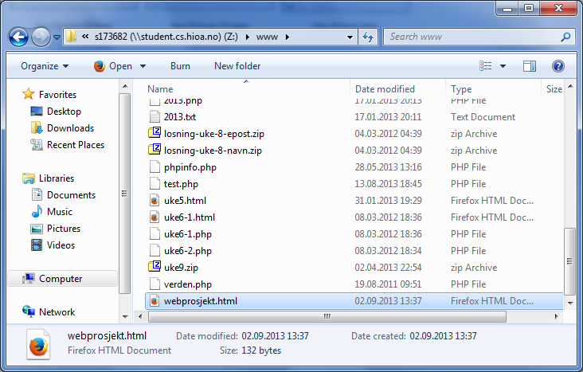

6. Ditt hjemmeområde er nå synlig under "Computer", og tilgjengelig som en hvilken som helst annen mappe, for kopiering og lagring.
>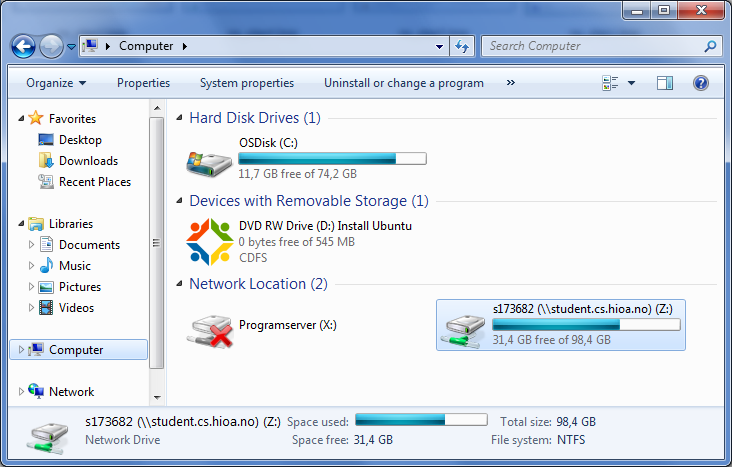

7. Dersom du har lagt fila "webprosjekt.html" under www-mappen, vil den være tilgjengelig for browseren med url'en "student.cs.hioa.no/~sxxxxxx/webprosjekt.html" der xxxxxx er ditt studentnr.
>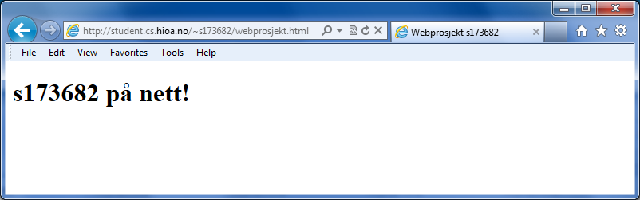

[Til toppen](#publisering)

## Mac

1. Finder > Go > Connect to Server.
>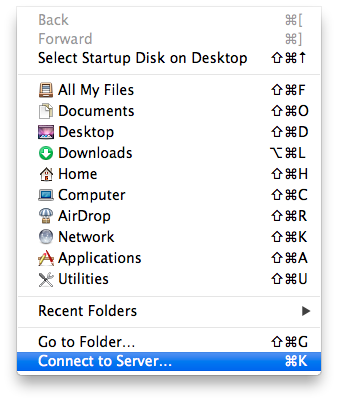

2. Skriv inn server-adresse som bå bildet, men med ditt studentnummer, begge steder i adressen. 
>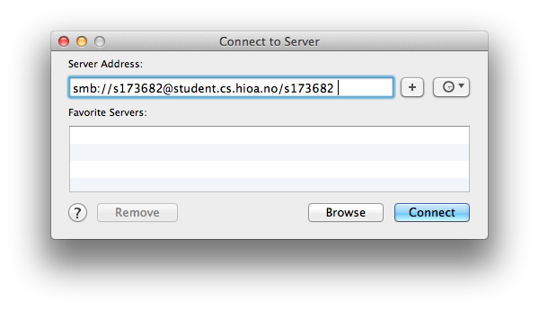

3. Skriv inn ditt passord. Velg selv om du vil huske passordet i "Keychain"
>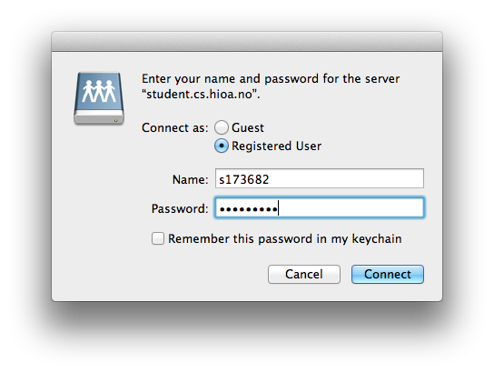

4. Du vil nå få opp ditt hjemmeområde som en "drive" på din mac (tilsvarende som når du installerer programmer). Driven vil være dilgjengelig via et disk-ikon på ditt skrivebord, og i finder. Det du nå legger i mappen "www" på ditt hjemmeområde, blir synlig på nett.
>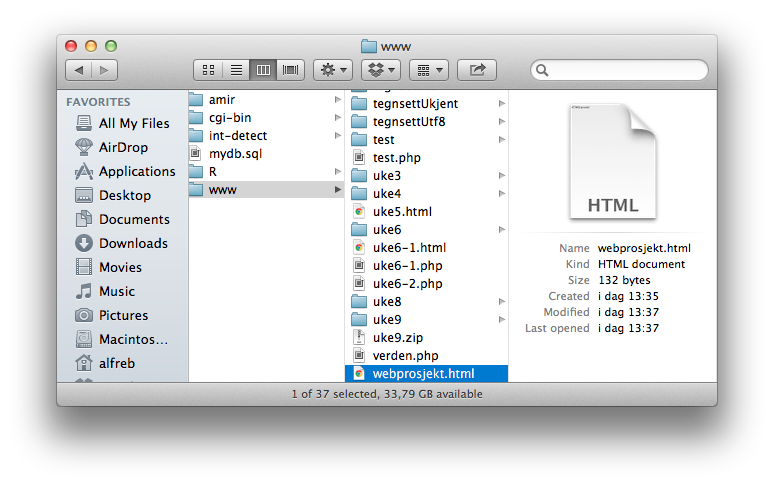

5. Dersom du nå legger en HTML-fil i din www-mappe og kaller den `webprosjekt.html` kan du åpne den i en browser via adressen "student.cs.hioa.no/~sxxxxxx/webprosjekt.html" der xxxxxx er ditt studentnummer.
>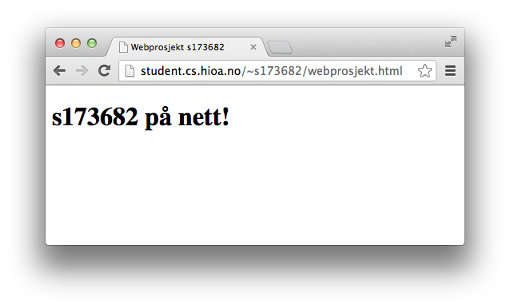

[Til toppen](#publisering) 

## Linux

Det vil variere mellom de ulike linux- distribusjonene hvordan dette gjøres via GUI, men her er en veiledning fra **Ubuntu 12.04 LTS**. Det er sannsynligvis svært likt på de fleste andre moderne distroer.

1. Fra filmenyen i Nautilus (Gå feks. via "Home Folder"), trykk "Go > Location". Du får da opp et utforskervindu, med en adresselinje. Skriv inn adressen som på bildet, men med ditt studentnummer.
>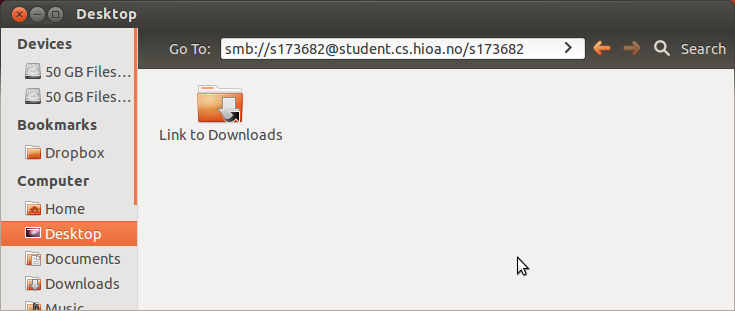

2. Skriv inn "ADA" under Domain, og ditt passord i passordfeltet. Velg selv hvor lenge passordet skal huskes - husk bare passordet dersom du har aktivert automatisk utlogging/låsing av maskinen din.
>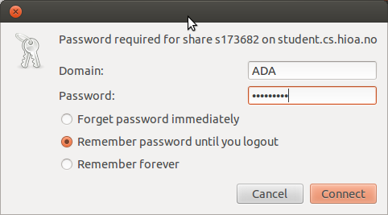

3. Du får nå opp et utforskervindu med ditt hjemmeområde. Alt som legges i www-mappen havner på nett.
>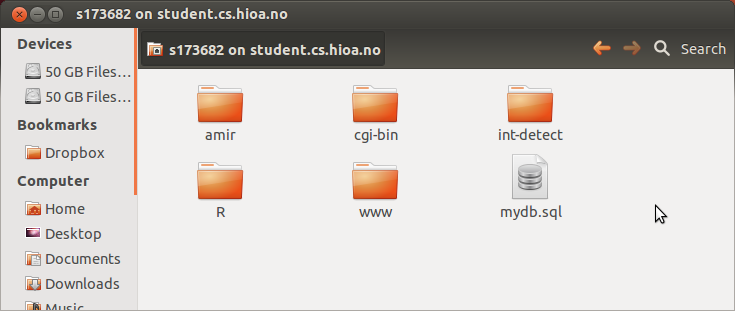

4. Du kan nå feks. lage et HTML-dokument her, kalt `webprosjekt.html`. Www-mappen i ditt hjemmeområde er tilgjengelig som en vanlig mappe, fra alle programmer.
>

5. Dette dokumentet er nå tilgjengelig via internett, på adressen "student.cs.hioa.no/~sxxxxxx" der xxxxxx er ditt studentnummer.
>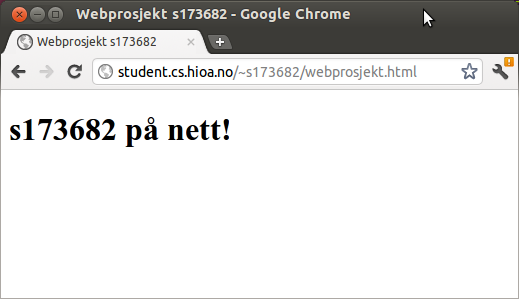

6. Hjemmeområdet ditt er også tilgjengelig via terminal. Det vil variere hvor området blir montert opp avhengig av distribusjon. For Ubuntu 12.04 havner mappen i `~/.gvfs/sxxxxxx` der xxxxxx er ditt studentnr. Er du usikker på hvor mappen havnet kan du skrive `$ mount` og se etter linjen med "gvfs". 
>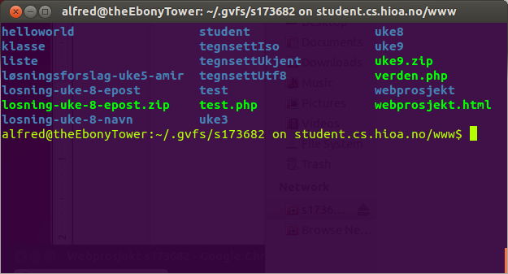

Det er også mulig å montere opp (mounte) hjemmeområdet manuelt i terminal, som et hvilket som helst samba-share. Da kan du få det i den mappen du ønsker. For denne løsningen, google "mount samba share [din favoritt-distro]"

[Til toppen](#publisering)

## Terminal
I både linux og Mac har du flere muligheter for å jobbe via terminal. 

### Jobbe via samba share
Her vil vi forutsette at man mounter opp sitt hjemmeområde som beskrevet over, først.

For Mac vil hjemmeområdet finnes under `/Volumes/sxxxxxx` der xxxxxx er ditt studentnr.

    	$ cd /Volumes/s173682/
		$ ls
		$ cd www
		$ ls -l
		...
		-rw-r--r--   1 alfreb  staff     34 Aug 19  2011 verden.php
		drwxr-xr-x   2 alfreb  staff  16384 Sep  2 15:47 webprosjekt
		-rw-r--r--   1 alfreb  staff    132 Sep  2 13:37 webprosjekt.html 

For hvor området havner i Linux, se forrige avsnitt. 

Når du har funnet frem til hvor hjemmeområdet ditt ligger, kan du redigere filene der direkte, feks. med emacs:

		$ emacs webprosjekt.html

Når du lagrer vil filen oppdateres direkte på server, og være tilgjengelig for hele verden.		

### Via ssh
Instituttet tilbyr ssh-tilgang (secure shell) for studenter via studssh. Dette fungerer direkte både fra  mac- og linuxterminaler, og via [Putty](http://www.chiark.greenend.org.uk/~sgtatham/putty/download.html) eller [cygwin](http://www.cygwin.com/) for Windows. Kommandoen 

    	$ ssh s173682@studssh.cs.hioa.no

(med ditt brukernavn) lar deg logge inn direkte på skolens server. Etter å ha godkjent evt. sertifikater (kun første gang) og oppgitt passord kan du gå inn i www-mappen din og starte emacs, akkurat som over, og endringene blir lagret direkte på serveren. Du kan også kopiere filer over ssh, med kommandoen `scp` (Secure copy). Eksempel:

		$ scp index.html s173682@studssh.cs.hioa.no:www/webprosjekt/

Her kopieres filen index.html fra mappen du står i lokalt på din PC, til mappen "webprosjekt" i "www"-mappen (for student s173682 - du må bruke ditt studentnr.). Denne filen blir da tilgjengelig via url'en `http://student.cs.hioa.no/~s173682/webprosjekt/`. (Siden fila heter "index.html", som er den fila webserveren automatisk ser etter, trenger man kun å oppgi mappenavnet, og ikke filnavnet. For andre filnavn må dette hektes på etter mappenavnet)

[Til toppen](#publisering)

## Bidra!

Dersom du ser ting som kunne vært beskrevet bedre, eller dersom du feks. har funnet ut hvordan man kobler seg til via et annet OS, føl deg fri til å forke repositoriet, oppdatere denne fila, committe, pushe og sende pull-request. Er bidraget seriøst og nyttig blir det inkludert her.
